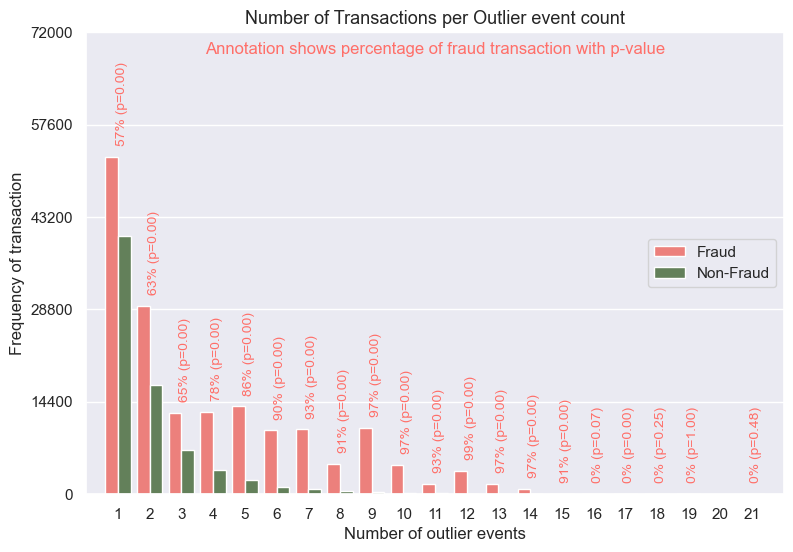
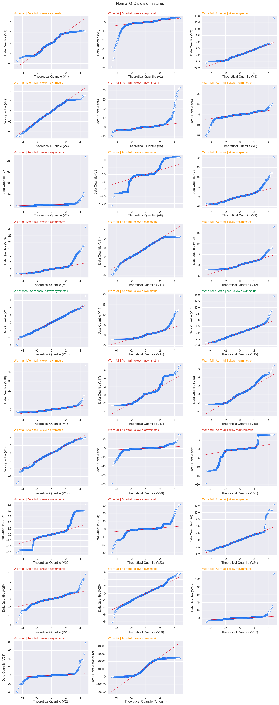
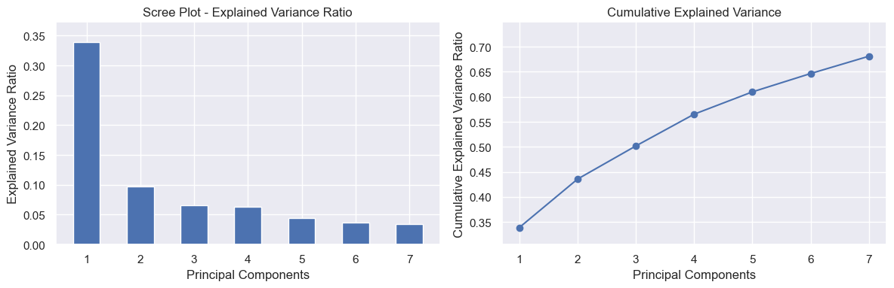

# Unsmasking Deception: Advanced Credit Card Fraud Detection
Dataset Source from Kaggle: https://www.kaggle.com/datasets/nelgiriyewithana/credit-card-fraud-detection-dataset-2023

## What's The Problem?
Currency exchange is one of the most common operations in the banks. This operation allows the economy to increase; that term is simple. 

However, the problem is more complicated than that term, some cashiers fail to register the exchange operation and instead keep the difference for themselves. It is a small operational error but it poses a significant risk to reputational banks, since small schemes happen they will grow into big schemes because small schemes can evolve into more significant frauds in the future. 

Furthermore, these incidents are also hard to detect since internal audit teams need to process and manually review all documents.

## How to solve it?
One of the best and most common ways to solve this problem is through statistical analysis to explore the data and utilize machine learning for fraud detection. Models commonly used include: 

- Logistic Regression
- GaussianNB
- SGDClassicifier
- Catboost
- Neural Network

### Exploration Data Analysis
#### Outlier Event

As evident from the image, each instance of fraud exhibits a higher value than typical outliers, as indicated by the p-value.

#### Q-Q Plot

We utilize three parameters From the graph to evaluate the data: the Shapiro-Wilk test represented by Wα Anderson-Darling Normality test denoted as Aα and Skewness measured by skew. These three parameters provide insight into the distribution of the graph.

- The Shapiro-Wilk test assesses the degree of normality of the data, examining its proximity to a normal distribution.
- Anderson-Darling Normality test measures how far the data deviate from a normal distribution.
- Skewness offers valuable insights into the type of distribution being observed.

#### PCA Analysis

This plot illustrates the number of components required to capture 95% of the data variance. This information is valuable as it helps improve efficiency and reduces data complexity.

`Number of components needed to retain 95% data: 11`

### Models
#### Data Models without PCA
| Metric                   | Accuracy  | Precision | Recall    | F1        |
|--------------------------|-----------|-----------|-----------|-----------|
| Neural Network Validate  | 99.957%   | 99.914%   | 100.000%  | 99.957%   |
| CatBoost Validate        | 99.865%   | 99.762%   | 99.970%   | 99.866%   |
| CatBoost Train           | 99.846%   | 99.729%   | 99.964%   | 99.846%   |
| Neural Network Train     | 99.725%   | 99.607%   | 99.843%   | 99.725%   |
| SGDClassifier Validate   | 96.548%   | 98.104%   | 94.942%   | 96.497%   |
| SGDClassifier Train      | 96.535%   | 98.208%   | 94.797%   | 96.472%   |
| Logistic Regression Validate | 96.514% | 97.692%  | 95.289%   | 96.476%   |
| Logistic Regression Train | 96.481% | 97.787%  | 95.111%   | 96.431%   |
| GaussianNB Train         | 91.889%   | 97.559%   | 85.920%   | 91.371%   |
| GaussianNB Validate      | 91.815%   | 97.362%   | 85.986%   | 91.321%   |

#### Data Models with PCA
| Metric                           | Accuracy  | Precision | Recall    | F1        |
|----------------------------------|-----------|-----------|-----------|-----------|
| Neural Network Validate PCA      | 99.511%   | 99.189%   | 99.840%   | 99.514%   |
| CatBoost Validate PCA            | 98.240%   | 98.891%   | 97.579%   | 98.231%   |
| CatBoost Train PCA               | 98.202%   | 98.875%   | 97.511%   | 98.188%   |
| Neural Network Train PCA         | 96.860%   | 96.915%   | 96.798%   | 96.857%   |
| SGDClassifier Validate PCA       | 94.445%   | 96.120%   | 92.647%   | 94.352%   |
| Logistic Regression Validate PCA | 94.425%   | 95.854%   | 92.886%   | 94.347%   |
| Logistic Regression Train PCA    | 94.339%   | 95.840%   | 92.697%   | 94.242%   |
| SGDClassifier Train PCA         | 94.301%   | 96.392%   | 92.043%   | 94.167%   |
| GaussianNB Train PCA            | 92.167%   | 96.620%   | 87.384%   | 91.770%   |
| GaussianNB Validate PCA         | 91.815%   | 97.362%   | 85.986%   | 91.321%   |

The Conclusion: Based on the data, the most effective models are Neural Network and CatBoost 
| Metric                   | Accuracy  | Precision | Recall    | F1        |
|--------------------------|-----------|-----------|-----------|-----------|
| Neural Network Validate  | 99.957%   | 99.914%   | 100.000%  | 99.957%   |
| CatBoost Validate        | 99.865%   | 99.762%   | 99.970%   | 99.866%   |
| CatBoost Train           | 99.846%   | 99.729%   | 99.964%   | 99.846%   |
| Neural Network Train     | 99.725%   | 99.607%   | 99.843%   | 99.725%   |
